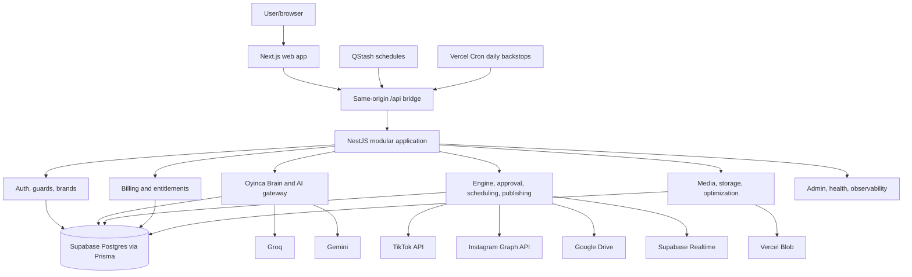

# Oyinca system architecture

## Runtime map

## Application boundaries

The web app owns rendering and interaction. Nest controllers own transport contracts, guards own request authorization, services own domain logic, and Prisma owns persistence. The system is a modular monolith deployed through one Vercel project; no reliable background process is assumed.

The Brain owns context, memory, semantic decisions, provider-independent inference, evaluation, and learning. The Engine owns workflow state and combines the Brain with deterministic approval, entitlements, scheduling, and publication. Billing, authentication, storage, and platform credentials remain separate domain authorities.

## Key flows

### Authentication

Email/password or TikTok-native identity → Auth service → signed httpOnly session cookie → JWT strategy → user/org/brand guards. TikTok login identity is distinct from optional content-posting scopes.

### Content and publishing

Upload/Drive asset → ownership and quota validation → Blob/MediaAsset → Engine processing → content analysis → task-specific Brain context → provider-routed caption/hashtags → draft/approval → scheduled PostTarget → authenticated cron sweep → atomic claim → platform call → log/event/metrics.

### Learning

TikTok metrics sync → immutable performance snapshots → Brain outcome events → aggregation with minimum evidence, contradictions, expiry, and decay → active learned insight → later Context Resolver selection.

### Billing

Plan selection → Stripe/Paystack provider → verified, idempotent webhook → Subscription → server-authoritative EntitlementsService/UsageService → guarded product operation.

## Current and planned

Implemented components are shown above. Additional providers, social platforms, semantic retrieval, general agent processes, and platform adapters are planned possibilities only. See `docs/architecture/oyinca-context-audit.md` for gaps and `docs/repository-map.md` for navigation.
