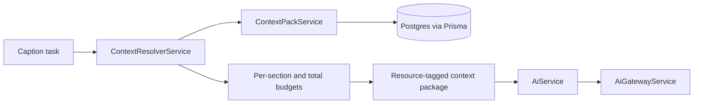

# Context Engine

## Goal

The Context Engine gives Oyinca tasks a compact, tenant-scoped, traceable view of existing knowledge. Logical `oyinca://` URIs describe stable resource contracts while Prisma remains the physical storage interface.

## Current implementation

`ContextResolverService.resolve()` accepts organization, brand, task, objective, and current task data. For `generate_caption` it requests only brand, audience, content preferences, mounted platform state, and evidence-backed performance learning from `ContextPackService.buildScoped()`.

## Resources

| Logical resource | Current source | Why selected for captions |
|---|---|---|
| `oyinca://task/current` | request topic/platform/tone | mandatory operation data |
| `oyinca://brand/identity` | Brand, BusinessBrain, active Product | facts, voice, restrictions, real offers |
| `oyinca://brand/audience` | BusinessBrain audience fields | relevant language and framing |
| `oyinca://brand/content-preferences` | pillars, hashtag/emoji/CTA settings | explicit output constraints |
| `oyinca://platforms/mounted` | connected SocialAccount rows | actual connected platform state |
| `oyinca://memory/learnings` | active, unexpired LearnedInsight rows | proven preferences without raw history |

These are internal identifiers, not folders, routes, or public URLs. They must never expose OAuth tokens.

## Selection and budgets

Caption priority is: task → brand → audience → content constraints → mounted platforms → performance learnings. The total context ceiling is 6,000 characters. Each database section has its own ceiling so a product catalog cannot displace hard preferences or task data. Missing sections are listed in `omittedSections`; missing memory does not invent defaults.

Every item includes source record IDs, a selection reason, and optional capture/expiry/confidence metadata. `BrainDecision.contextSections` records selected resource URIs. External market content remains explicitly untrusted and is not selected for ordinary captions.

## Security rules

- Call `buildScoped(organizationId, brandId, ...)` for user-specific operations.
- Empty/mismatched tenant lookups return no persistent context.
- Never include secrets, tokens, payment data, raw account history, or hidden reasoning.
- The HTTP guard establishes access; the resolver repeats organization/brand scoping as defense in depth.
- Models receive context to generate content, never authority to execute an action.

## Extension process

Add a task profile only when a real workflow is migrated. Define required sections, priority, budgets, resource mapping, output contract, and tests first. Prefer existing structured fields and SQL selection. Add semantic/vector retrieval only after a measured case cannot be served efficiently by these mechanisms.
