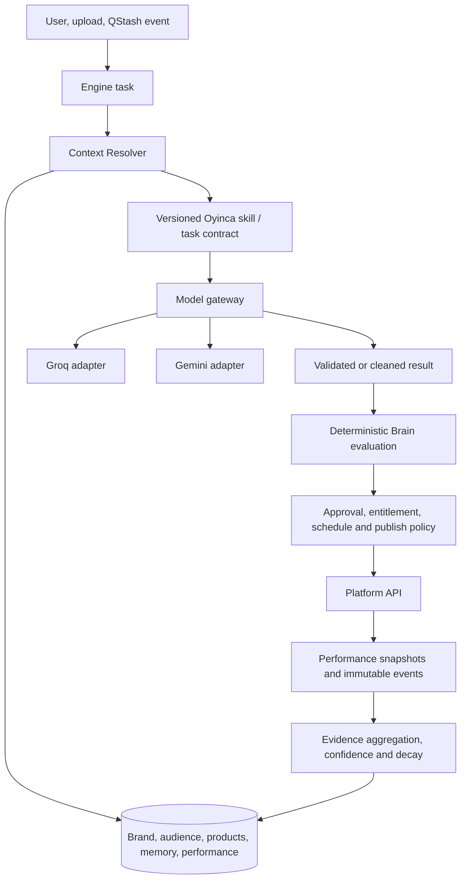

# Oyinca Brain architecture

## Current system

The Oyinca Brain is an application layer above replaceable models. It owns durable brand context, task-specific retrieval, structured content analysis and decisions, deterministic evaluation, feedback/outcome recording, and evidence-based learning. Groq and Gemini supply inference through `AiGatewayService`; neither provider owns business memory or policy.

## Context layers

- Static system knowledge: versioned skill instructions, platform guidance, schemas, and deterministic policy in source control.
- Persistent tenant knowledge: `BusinessBrain`, `Product`, `MemoryEntry`, `BrainEvent`, `LearnedInsight`, `ContentAnalysis`, and performance records in Postgres.
- Dynamic task context: resource-tagged, budgeted packages assembled by `ContextResolverService`.

## Memory

Current memory maps pragmatically to the requested categories:

- Semantic: owner-supplied Business Brain fields, products, and active learned insights.
- Episodic: immutable Brain events linked to posts/decisions.
- Performance: time-series `PostPerformance` plus evidence-backed insights.
- Working: the transient resolved context package; it is not persisted as customer memory.
- Policy/procedural: explicit Brain restrictions, Engine approval mode, plan entitlements, scheduling configuration, and deterministic code.

Insights require at least three supporting events. Confidence reflects support/contradiction, expires, and decays. Raw performance remains separate from derived knowledge.

## Model routing and observability

`AiGatewayService` reads provider order, checks configuration, bounds calls, retries alternate keys/providers, normalizes output, and returns provider/model/token/latency/cost metadata. `BrainDecision` stores operational summaries, resource sections, reason codes, evaluation, and outcome without chain-of-thought. `AiUsageLog` still stores raw prompt/completion and is a documented privacy debt.

## Permission and action policy

There is no general-purpose agent ACL framework yet. The current effective permission system is intentionally concrete: JWT and organization/brand guards, platform-admin guard, entitlements, Engine state, manual/auto approval mode, connected-account scopes, post/target status, quota reservations, and atomic publishing claims. The model produces content or a proposal; these deterministic controls decide whether any external action can occur.

This is preferable to adding abstract agent roles before independent agents exist. A future task lifecycle should extend `EngineEvent`/`BrainDecision` only when cancellable or waiting tasks become a real product need.

## Platform mounting

Connected `SocialAccount` records are mounted capabilities. OAuth scope and review state derive supported TikTok operations. Disconnecting removes capability without deleting the tenant's Brain. A generic `PlatformAdapter` is deferred until another production integration proves the shared contract; current explicit branches make unsupported differences visible.

## Security boundaries

Every private Brain record is organization/brand scoped. Controllers use authentication and brand guards; the Context Resolver also scopes its query. Provider prompts exclude OAuth/payment secrets. Model output is validated and malformed structured decisions fail to a low-confidence, non-publishable state.

## Planned direction

Future work should migrate hashtag/content-idea tasks to explicit profiles, minimize `AiUsageLog`, add optimistic concurrency for draft edits, and make safe cost comparisons from production telemetry. Semantic retrieval and a general task/agent permission model remain future options, not implemented features.
